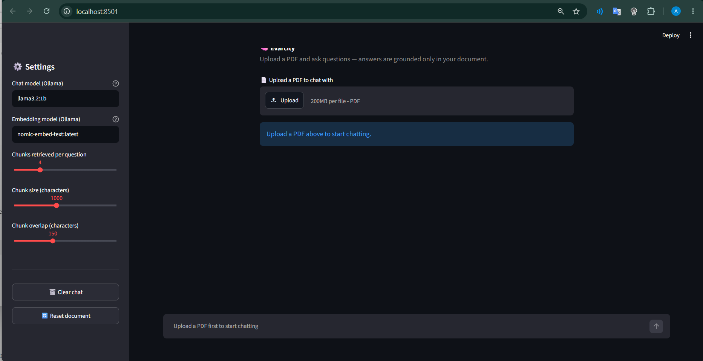
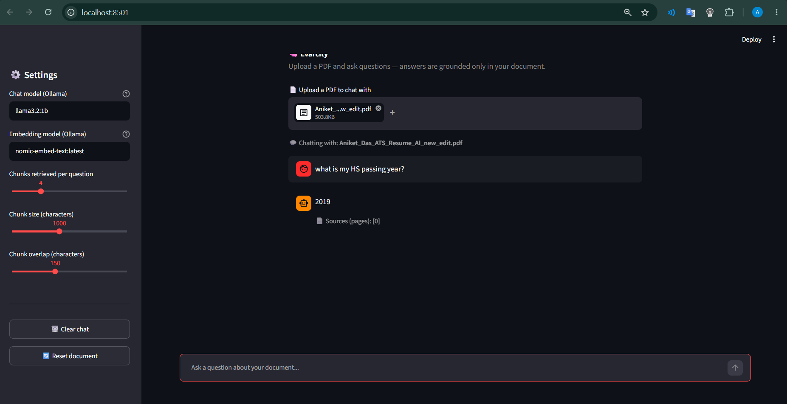

# 🧠 Risk & Document Analysis using RAG

A Retrieval-Augmented Generation (RAG) based document question-answering application that allows users to upload PDF documents and ask questions about their content.

The application retrieves relevant information from the uploaded document and generates answers using a locally running Large Language Model (LLM). The system is designed to keep responses grounded in the information available in the uploaded document.

---

## 📌 Project Overview

This project implements a complete RAG pipeline for analyzing PDF documents.

Users can upload a PDF through an interactive Streamlit interface and ask questions about the document. The application extracts text from the PDF, divides it into smaller chunks, converts the chunks into embeddings, stores them in a Chroma vector database, retrieves the most relevant chunks for a question, and passes the retrieved context to an Ollama-based LLM to generate the final answer.

The application also displays the source pages used to generate an answer.

---

## 🎯 Objectives

- Build a document-based Question Answering system.
- Implement a complete Retrieval-Augmented Generation pipeline.
- Extract and process information from PDF documents.
- Use vector similarity search to retrieve relevant information.
- Generate context-grounded answers using a local LLM.
- Provide an easy-to-use web interface using Streamlit.
- Reduce unsupported answers by restricting the LLM to retrieved document context.

---

## 🔄 RAG Workflow

```text
                PDF Document
                     │
                     ▼
             PDF Text Extraction
                     │
                     ▼
                Text Chunking
                     │
                     ▼
             Ollama Embeddings
                     │
                     ▼
             Chroma Vector Store
                     │
                     ▼
              Similarity Search
                     │
                     ▼
              Relevant Chunks
                     │
                     ▼
                LangGraph
                     │
                     ▼
                Ollama LLM
                     │
                     ▼
             Contextual Answer
                     │
                     ▼
              Source Page(s)
```

---

## 🛠️ Technologies Used

| Technology | Purpose |
|---|---|
| Python | Core programming language |
| Streamlit | Interactive web interface |
| LangChain | RAG components and document processing |
| LangGraph | RAG workflow orchestration |
| Ollama | Local LLM and embedding models |
| LLaMA | Local language model for answer generation |
| ChromaDB | Vector database for semantic search |
| PyPDF | PDF document loading and text extraction |

---

## ⚙️ Key Features

### 📄 PDF Upload

Users can upload PDF documents directly through the Streamlit application.

### 🔍 Document Processing

The application extracts text from the uploaded PDF and divides it into smaller chunks for efficient retrieval.

### 🧠 Embeddings

The text chunks are converted into vector representations using an Ollama embedding model.

### 🗄️ Vector Database

The generated embeddings are stored in Chroma for similarity-based retrieval.

### 🔎 Context Retrieval

When a user asks a question, the system retrieves the most relevant document chunks.

### 🤖 Local LLM

The retrieved context is provided to an Ollama-based LLM to generate the answer.

### 📑 Source Pages

The application displays the document pages used to answer the question.

### 💬 Interactive Chat

Users can ask multiple questions about the uploaded document through the Streamlit chat interface.

---

## 🏗️ System Architecture

The application consists of the following major components:

### 1. Document Loader

`PyPDFLoader` loads the uploaded PDF and extracts its content.

### 2. Text Splitter

`RecursiveCharacterTextSplitter` divides the document into smaller chunks.

### 3. Embedding Model

`OllamaEmbeddings` converts document chunks into vector representations.

### 4. Vector Store

Chroma stores the embeddings and performs similarity-based retrieval.

### 5. Retriever

The retriever searches for the most relevant chunks based on the user's question.

### 6. LangGraph Workflow

LangGraph connects the retrieval and answer-generation stages into a structured workflow.

### 7. LLM

`ChatOllama` generates an answer using the retrieved document context.

---

## 📂 Project Structure

```text
PDF-Risk-Analysis-RAG/
│
├── evarcity_app.py
├── test_rag_fixed.ipynb
├── requirements.txt
├── README.md
├── .gitignore
│
└── screenshots/
    ├── home.png
    ├── pdf-upload.png
    └── answer.png
```

### Files

**`evarcity_app.py`**

Main Streamlit application containing the complete RAG pipeline and user interface.

**`test_rag_fixed.ipynb`**

Notebook used for developing and testing the RAG workflow.

**`requirements.txt`**

Contains the Python dependencies required to run the application.

**`README.md`**

Project documentation and setup instructions.

---

## 💻 Installation

### 1. Clone the Repository

```bash
git clone YOUR_GITHUB_REPOSITORY_URL
```

Move into the project directory:

```bash
cd RAG-PDF-Analysis-QA
```

---

### 2. Create a Virtual Environment

For Windows:

```bash
python -m venv venv
```

Activate it:

```bash
venv\Scripts\activate
```

---

### 3. Install Dependencies

```bash
pip install -r requirements.txt
```

---

## 🦙 Ollama Setup

This project uses Ollama to run the LLM and embedding model locally.

Install Ollama and make sure it is running.

Check the installed models:

```bash
ollama list
```

Pull the required models:

```bash
ollama pull llama3.2:1b
```

```bash
ollama pull nomic-embed-text
```

The application can also be configured from the Streamlit sidebar to use other Ollama models available on your system.

---

## ▶️ Run the Application

Start the Streamlit application:

```bash
streamlit run evarcity_app.py
```

After running the command, Streamlit will provide a local URL.

Open the URL in your browser.

---

## 📝 How to Use

### Step 1 — Upload a PDF

Upload a PDF document using the file uploader.

### Step 2 — Process the Document

The application extracts the PDF text, creates chunks, generates embeddings, and stores them in the Chroma vector database.

### Step 3 — Ask a Question

Enter a question related to the uploaded document.

Example:

```text
What is the main topic of this document?
```

### Step 4 — Retrieve Relevant Information

The RAG pipeline searches the vector database and retrieves relevant document chunks.

### Step 5 — Generate the Answer

The retrieved context is passed to the local LLM.

### Step 6 — View the Answer

The application displays the generated answer along with the relevant source pages.

---

## 📸 Screenshots

### Home Page



### PDF Upload



### Question Answering


---

## 💼 Potential Business Use Cases

The document analysis approach used in this project can be adapted for:

- Risk and compliance document analysis
- Policy and procedure review
- Audit documentation
- Regulatory document analysis
- Internal control documentation
- Investigation support
- Financial document analysis
- Legal document review
- Corporate knowledge management

These are potential applications of the underlying RAG architecture rather than claims that the current application performs automated fraud or regulatory investigations.

---

## 🔐 Security Considerations

This project is designed to process documents locally using Ollama.

When publishing the project to GitHub:

- Do not upload API keys.
- Do not upload passwords or credentials.
- Do not upload private `.env` files.
- Do not upload confidential PDF documents.
- Do not upload generated vector databases.
- Avoid committing sensitive information inside notebooks.

---

## 🚀 Future Improvements

Possible future improvements include:

- Multi-document question answering
- Risk keyword detection
- Automated risk categorization
- Document comparison
- Improved source citation
- Document summarization
- Risk scoring
- Authentication and user management
- Cloud deployment
- Support for additional document formats
- Evaluation metrics for RAG response quality

---

## 📚 Learning Outcomes

Through this project, the following concepts were implemented:

- Retrieval-Augmented Generation
- Large Language Models
- Embeddings
- Vector databases
- Semantic search
- PDF document processing
- Text chunking
- Prompt engineering
- LangChain
- LangGraph
- Ollama
- Streamlit
- Python

---

## 👨‍💻 Author

**Aniket Das**

AI/ML Developer | Python | Machine Learning | Data Analytics | Generative AI

---

## 📄 License

This project is available for educational and portfolio purposes.
